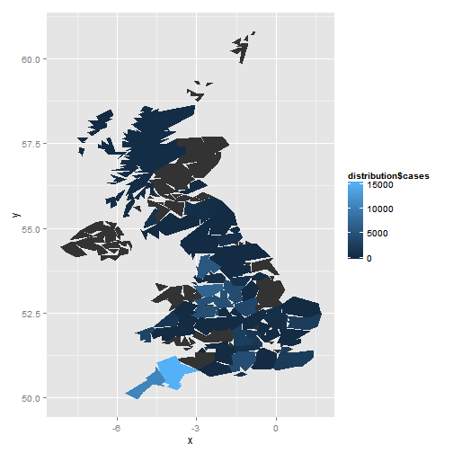

<center> Bovine Spongiform Encephalopathy Surveillance Statistics in United Kingdom </center>
========================================================
**Background**<br/>
Bovine Spongiform Encephalopathy(BSE), or the so called "Mad Cow" disease,is a kind of prion related disease, which is fatal and trigger neurological dysfunction in Cattles. Prions are neither bacteria nor viruses, with no genetic informaiton, but still causes disease. It has long invubation period and progess inexorably once clinical conditions occur.(Araujo,2013) BSE can be transmitted by eating food containing brain,spinal cord or other nervous system tissue fro an infected animal, and prions begin to slowly transform normal protein into the abonormal prion shape, which eventually leads to fatal damage to the nervous system.The human form of BSE is called Creutzfeldt-Jakob Disease(CJD).BSE can cause death usually within one year of onset of illness.

**Motivation**<br/>
Bovine Spongiform Encephalopathy disease was first found in the mid-1980s from 16 cattle, and that number dramatically increased to over 190,000 cases worldwide, with the majority of them in Europe.(Lee et al., 2013) ,Which led to a disaster to human, the agricultural industry and the food industry. The worst case of BSE was happened in the United Kingdom, and in this analysis, we will take a close look at the developent of BSE in the United Kingdom.Since the research I am doing is about BSE diagnosis, and I think it is interesting to look at the history of this disease. Moreover, by inverstingating this case, it makes people have a better awareness of the importance of food safety.

**Data Collecting**<br/>
These data is obtained from Animal Health and Veterinary Laboratories Agency,"http://www.defra.gov.uk/ahvla-en/publication/tse-stats-cattle/".BSE cases in every year/every month is available, and it is also catagorized into active and passive surveillance. Also the birth date and age of all suspected animals are recorded. Four pdfs have data from before year 1987 to 2014, and then I converted them to csv format.Additionally, I downloaded the UK shape file, which can be used to plot the distribution of BSE.Since the name of every city in two files don't match, I need to do some modification to plot the map.

**Required Packages**<br/>

library(reshape)<br/>
library(ggplot2)<br/>
library(knitr)<br/>
library(maptools)<br/>
library(plyr) 


**Possible questions that could be answered**<br/>

1. What is the overall trending of BSE from 1987 to 2014? What is the trending of passive Surveillance and active surveillance?<br/>

2. What are the locations of BSE?<br/>

3. What is the percent reduction year on year?<br/>

4. How many confirmed cases of BSE per million head of cattle population over 24 months of age?<br/>

5. What is the trending of BSE by comfirmed cases of BSE in the UK by year of birth and age?<br/>

6. On August 1st, 1996, extra control measures on animal feed containing mammalian meat and bone meal are considered to have been fully implemented, and what is trending of BSE after this date? <br/>


**trend of passive and active surveillance in united kingdom**

```r
library(reshape)
```

```
## Loading required package: plyr
## 
## Attaching package: 'reshape'
## 
## The following objects are masked from 'package:plyr':
## 
##     rename, round_any
```

```r
library(ggplot2)
pa <- read.csv("C:/Users/sding/Documents/GitHub/585xproject/passive and active.csv")
pa$Year <- as.character(pa$Year)
pa$Year[pa$Year == "Pre 1988"] <- "1986-1988"
a.melt <- melt(pa[1:28, c(1:3, 5:6)], id = c("Year"))
pd <- position_dodge(0.1)
ggplot(data = a.melt, aes(x = Year, y = value, colour = variable)) + geom_line(position = pd, 
    aes(group = variable))
```

```
## ymax not defined: adjusting position using y instead
```

 

This plot shows the majority of data is from the passive surveillance in great britain, and BSE cases were the most from 1989-1996.Now we can take a look at great britain.

**trend of passive surveillance in great britain**

```r
overall <- read.csv("C:/Users/sding/Documents/GitHub/585xproject/OVERALL.csv")
trend <- overall[1:28, ]
trend.det <- melt(trend)
```

```
## Using YEAR as id variables
```

```r
pd <- position_dodge(0.1)
ggplot(data = trend.det, aes(x = YEAR, y = value, colour = variable)) + geom_line(position = pd, 
    aes(group = variable))
```

```
## ymax not defined: adjusting position using y instead
```

 


This plot shows the trend of restricted case and confirmed case. They all follow the similar curve, but the amplitude is different.

**Cattle population over 24 months of ages and number of confirmed cases per million**

```r
library(reshape)
library(ggplot2)
age24 <- read.csv("C:/Users/sding/Documents/GitHub/585xproject/millioncattle.csv")
age24 <- age24[c(1:75), -c(5, 8)]
colnames(age24) <- c("start", "end", "million of cattles", "# of case by date of confirmation", 
    "# of case by date of restriction", "# per million by data of confirmation", 
    "# per million by date of restriction")
age.sub <- age24[-1, ]
age.sub$name <- 1:74
age.sub[, 1] <- as.Date(x = paste("1-", age.sub[, 1], sep = ""), format = "%d-%b-%y")
age.sub[, 2] <- as.Date(x = paste("1-", age.sub[, 2], sep = ""), format = "%d-%b-%y")
age.sub$"# per million by data of confirmation" <- as.numeric(as.character(age.sub$"# per million by data of confirmation"))
mdfr <- melt(age.sub, measure.vars = c("start", "end"))
mage <- melt(age.sub, measure.vars = c("start", "end"))
layout(t(1:2))
ggplot(mdfr, aes(mdfr$value, as.factor(mdfr$"million of cattles"))) + geom_line(size = 6) + 
    xlab("period") + ylab("million of cattles") + theme_bw()
```

 

```r
ggplot(mage, aes(mage$value, as.factor(mage$"# per million by data of confirmation"))) + 
    geom_line(size = 6) + xlab("period") + ylab("number per million by data of confirmation") + 
    theme_bw()
```

 


```
## Loading required package: sp
## Checking rgeos availability: FALSE
##  	Note: when rgeos is not available, polygon geometry 	computations in maptools depend on gpclib,
##  	which has a restricted licence. It is disabled by default;
##  	to enable gpclib, type gpclibPermit()
```

  

**Percent Reduction year on year**

```r
# percent reduction head(trend)
red <- trend[, c(1, 2, 8)]
red$"percent reduction year on year(suspected)" <- NA
red$"percent reduction year on year(confirmed)" <- NA
i <- NA
j <- NA
per <- NA
red[1:28, 2:3] <- as.matrix(sapply(red[1:28, 2:3], as.numeric))
percent <- function(x, digits = 2, format = "f", ...) {
    paste(formatC(100 * x, format = format, digits = digits, ...), "%", sep = "")
}

for (i in 3:(length(red$SUSPECTS.RESTRICTED))) {
    red$"percent reduction year on year(suspected)"[i] <- as.numeric((-red$SUSPECTS.RESTRICTED[i - 
        1] + red$SUSPECTS.RESTRICTED[i])/red$SUSPECTS.RESTRICTED[i - 1])
    red$"percent reduction year on year(confirmed)"[i] <- as.numeric((-red$SLAUGHTERED.SUSPECTS.IN.WHICH.BSE.CONFIRMED[i - 
        1] + red$SLAUGHTERED.SUSPECTS.IN.WHICH.BSE.CONFIRMED[i])/red$SLAUGHTERED.SUSPECTS.IN.WHICH.BSE.CONFIRMED[i - 
        1])
    if (red$SLAUGHTERED.SUSPECTS.IN.WHICH.BSE.CONFIRMED[i - 1] == 0) {
        red$"percent reduction year on year(confirmed)"[i] <- 0
    }
}

red.melt <- melt(red[, c(1, 4, 5)], id = c("YEAR"))
red.melt$value <- as.numeric(red.melt$value)
red.melt$value[is.na(red.melt$value)] <- 0
pd <- position_dodge(0.1)
ggplot(data = red.melt, aes(x = YEAR, y = value, colour = variable)) + geom_line(position = pd, 
    aes(group = variable))
```

```
## ymax not defined: adjusting position using y instead
```

 

**the trend of different age in great britain (confirmed case)**

```r
age <- read.csv("C:/Users/sding/Documents/GitHub/585xproject/age.gb.csv")
age <- age[-1, -2]
age$"Birth Period" <- 1982:2006
```

```
## Error: replacement has 25 rows, data has 27
```

```r
colnames(age) <- c("Birth Period", "1 year old", "2 year old", "3 year old", 
    "4 year old", "5 year old", "6 year old", "7 year old", "8 year old", "9 year old", 
    "10 year old")
age.melt <- melt(age, id = "Birth Period")
age.melt$value <- as.numeric(age.melt$value)
age.melt$"Birth Period" <- as.numeric(age.melt$"Birth Period")
age.melt$variable <- as.factor(age.melt$variable)

pd <- position_dodge(0.1)
ggplot(data = age.melt, aes(x = age.melt$"Birth Period", y = value, colour = variable)) + 
    geom_line(position = pd, aes(group = variable))
```

```
## ymax not defined: adjusting position using y instead
```

 


**In recent two years, the distribution of BSE cases in great britain**

```r
recent <- read.csv("C:/Users/sding/Documents/GitHub/585xproject/recent.csv")
a <- recent[-1, c(1, 2, 3, 4)]
recent[, c(2, 3, 4)] <- as.matrix(sapply(recent[, c(2, 3, 4)], as.numeric))
a$cases <- rowSums(recent[-1, c(2, 3, 4)])
a$County <- gsub("&", "and", a$County)
a <- a[, -c(2, 3, 4)]
a$County[a$County == "North-West Wales"] <- "Ceredigion"
colnames(a) <- c("region", "cases")

rec.dis <- merge(oz.subset, a, by = "region")
rec.dis$cases <- as.numeric(rec.dis$cases)
ggplot() + geom_polygon(data = oz.subset, aes(x = x, y = y, order = order, group = group)) + 
    geom_polygon(data = rec.dis, aes(x = x, y = y, order = order, group = group, 
        fill = rec.dis$cases))
```

 

